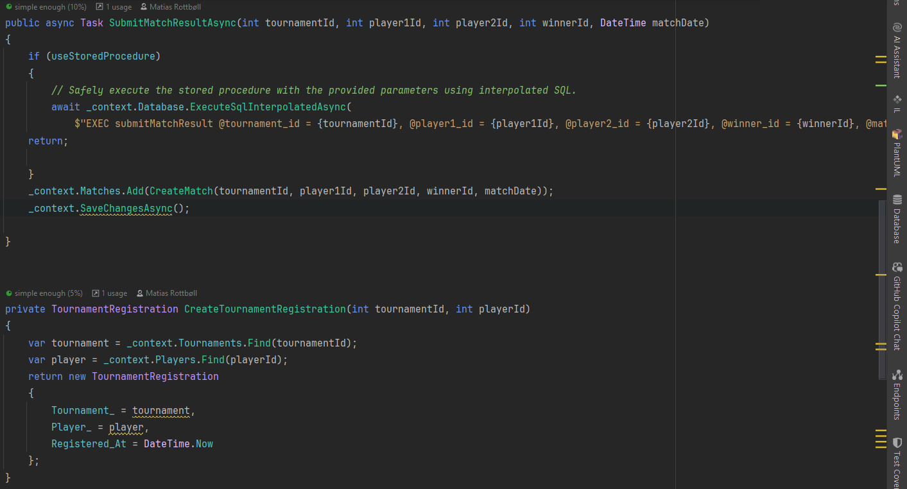

# OLA_1_DB

## Table of Contents
- [OLA\_1\_DB](#ola_1_db)
  - [Table of Contents](#table-of-contents)
  - [Introduction](#introduction)
  - [Task 1](#task-1)
    - [Datamodel](#datamodel)
      - [Players](#players)
      - [Tournaments](#tournaments)
      - [Tournament Registrations](#tournament-registrations)
      - [Matches](#matches)
    - [SQL Script](#sql-script)
  - [Task 2](#task-2)
    - [Result of 3 of the queries](#result-of-3-of-the-queries)
  - [Task 3](#task-3)
    - [Stored Procedures](#stored-procedures)
      - [register player](#register-player)
      - [joinTournament](#jointournament)
      - [submitMatchResult](#submitmatchresult)
    - [Functions](#functions)
      - [getTotalWins](#gettotalwins)
      - [getTournamentStatus](#gettournamentstatus)
    - [Triggers](#triggers)
      - [beforeInsertRegistration](#beforeinsertregistration)
      - [afterInsertMatch](#afterinsertmatch)
    - [Test af stored procedures, functions og triggers.](#test-af-stored-procedures-functions-og-triggers)
      - [Stored procedure - Register player](#stored-procedure---register-player)
      - [Function - getTournamentStatus](#function---gettournamentstatus)
      - [Trigger - BeforeInsertRegistration](#trigger---beforeinsertregistration)
  - [Task 4](#task-4)
  - [Documentation for med og uden stored procedures](#documentation-for-med-og-uden-stored-procedures)
      - [joinTourament code](#jointourament-code)
      - [submitMatchResult code](#submitmatchresult-code)
      - [joinTournament swagger and result](#jointournament-swagger-and-result)
      - [submitMatchResult swagger and result](#submitmatchresult-swagger-and-result)
  - [Task 5](#task-5)
    - [Betragtninger og fordele og ulemper](#betragtninger-og-fordele-og-ulemper)

---

## Introduction
Dette er vores aflevering repository for OLA 1. Under hver task ligger svarene til de forskellige opgaver. Opgaven er løst med en MsSQL database der kører i docker. Programmerings sproget er C# og vi har brugt Entity Framework til at kommunikere med databasen.


---

## Task 1

### Datamodel

#### Players

| Column      | Datatype       | Description             | Constraints                    |
|-------------|----------------|-------------------------|--------------------------------|
| `player_id` | INT            | Unique identifier       | Primary Key, Auto Increment    |
| `username`  | VARCHAR(255)   | Player's username       | NOT NULL, Unique               |
| `email`     | VARCHAR(255)   | Player's email address  | NOT NULL, Unique               |
| `ranking`   | INT            | Player's ranking score  |                                |
| `created_at`| DATETIME       | Timestamp of creation   | NOT NULL                       |

#### Tournaments

| Column         | Datatype       | Description                                      | Constraints                    |
|----------------|----------------|--------------------------------------------------|--------------------------------|
| `tournament_id`| INT            | Unique identifier for the tournament           | Primary Key, Auto Increment    |
| `name`         | VARCHAR(255)   | Name of the tournament                           | NOT NULL, Unique               |
| `game`         | VARCHAR(255)   | Game associated with the tournament              | NOT NULL                       |
| `max_players`  | INT            | Maximum number of players allowed in the tournament | NOT NULL                   |
| `start_date`   | DATE           | Date when the tournament begins                  | NOT NULL                       |
| `created_at`   | DATETIME       | Timestamp of tournament record creation          | NOT NULL                       |

#### Tournament Registrations

| Column            | Datatype    | Description                                         | Constraints                                        |
|-------------------|-------------|-----------------------------------------------------|----------------------------------------------------|
| `registration_id` | INT         | Unique identifier for the registration            | Primary Key, Auto Increment                        |
| `tournament_id`   | INT         | Identifier of the tournament                        | Foreign Key (Tournaments), NOT NULL                |
| `player_id`       | INT         | Identifier of the player                            | Foreign Key (Players), NOT NULL                    |
| `registered_at`   | DATETIME    | Timestamp when the registration was made            | NOT NULL                                           |

#### Matches

| Column         | Datatype    | Description                                           | Constraints                                          |
|----------------|-------------|-------------------------------------------------------|------------------------------------------------------|
| `match_id`     | INT         | Unique identifier for the match                       | Primary Key, Auto Increment                          |
| `tournament_id`| INT         | Identifier of the tournament                          | Foreign Key (Tournaments), NOT NULL                  |
| `player1_id`   | INT         | Identifier for the first player                       | Foreign Key (Players), NOT NULL                      |
| `player2_id`   | INT         | Identifier for the second player                      | Foreign Key (Players), NOT NULL                      |
| `winner_id`    | INT         | Identifier of the winning player                      | Foreign Key (Players)                                |
| `match_date`   | DATETIME    | Date and time when the match was played               | NOT NULL                                             |

### SQL Script
[SQL Script](./OLA1_DB_Script&TestData.sql)


## Task 2

```sql	
-- 1. Hent alle turneringer, der starter inden for de næste 30 dage.
select * 
from Tournaments
where start_date between GETDATE() and DATEADD(DAY, 30, GETDATE());

-- 2. Find det antal turneringer, en spiller har deltaget i.
select count(tournament_id) AS tournament_count
from TournamentRegistrations
where player_id = 1;

-- 3. Vis en liste over spillere registreret i en bestemt turnering.
select p.player_id, p.username
from TournamentRegistrations tr
join Players p on tr.player_id = p.player_id
where tr.tournament_id = 1;

-- 4. Find spillere med flest sejre i en bestemt turnering.
select winner_id, COUNT(*) as win_count
from Matches
where tournament_id = 1
group by winner_id
order by win_count desc;

-- 5. Hent alle kampe, hvor en bestemt spiller har deltaget.
select * 
from Matches
where player1_id = 1 or player2_id 1;

-- 6. Hent en spillers tilmeldte turneringer.
select t.name
from TournamentRegistrations tr
join Tournaments t on tr.tournament_id = t.tournament_id
where tr.tournament_id = 1;

-- 7. Find de 5 bedst rangerede spillere.
select top 5
from Players
order by ranking desc;

-- 8. Beregn gennemsnitlig ranking for alle spillere.
select avg(ranking) as average_ranking
from Players;

-- 9. Vis turneringer med mindst 5 deltagere.
select t.Name, count(*) as registrations
from Tournaments t
join TournamentRegistrations tr on tr.Tournament_Id = t.Tournament_Id
group by t.Tournament_Id, t.Name
having count(*) > 5;

-- 10. Find det samlede antal spillere i systemet.
select count(*) as total_players
from Players;

-- 11. Find alle kampe, der mangler en vinder.
select *
from Matches
where winner_id is null;

-- 12. Vis de mest populære spil baseret på turneringsantal.
select game, count(*) as tournament_count
from Tournaments
group by game
order by tournament_count desc;

-- 13. Find de 5 nyeste oprettede turneringer.
select top 5 *
from Tournaments
order by Created_At desc

-- 14. Find spillere, der har registreret sig i flere end 3 turneringer.
select player_id, count(tournament_id) as tournament_count
from TournamentRegistrations
group by player_id
having count(tournament_id) > 3;

-- 15. Hent alle kampe i en turnering sorteret efter dato.
select *
from Matches
where tournament_id = 1
order by match_date asc
```
### Result of 3 of the queries
Eksemplerne af vores queries er kørt på sql management studio og resultaterne er vist nedenfor.

Query 4


Query 8


Query 9


## Task 3

### Stored Procedures

#### register player

```sql
CREATE PROCEDURE registerPlayer
    @username VARCHAR(255),
    @email VARCHAR(255),
    @ranking INT = NULL
AS
BEGIN
    SET NOCOUNT ON;

    INSERT INTO Players (username, email, ranking, created_at)
    VALUES (@username, @email, @ranking, GETDATE());

    SELECT 'player registered' AS Message;
END;
GO
```
#### joinTournament

```sql
CREATE PROCEDURE joinTournament
    @tournament_id INT,
    @player_id INT
AS
BEGIN
    SET NOCOUNT ON;
    INSERT INTO TournamentRegistrations (tournament_id, player_id, registered_at)
    VALUES (@tournament_id, @player_id, GETDATE());
END;
GO
```

#### submitMatchResult 

```sql
CREATE PROCEDURE submitMatchResult
    @tournament_id INT,
    @player1_id INT,
    @player2_id INT,
    @winner_id INT,
    @match_date DATETIME
AS
BEGIN
    SET NOCOUNT ON;
    INSERT INTO Matches (tournament_id, player1_id, player2_id, winner_id, match_date)
    VALUES (@tournament_id, @player1_id, @player2_id, @winner_id, @match_date);
END;
GO
```

### Functions

#### getTotalWins

```sql
CREATE FUNCTION getTotalWins
(
    @player_id INT
)
RETURNS INT
AS
Begin
    DECLARE @totalWins INT;
    SELECT @totalWins = COUNT(*) FROM Matches WHERE winner_id = @player_id;
    RETURN @totalWins;
END;
GO
```

#### getTournamentStatus

```sql
CREATE FUNCTION getTournamentStatus
(
    @tournament_id INT
)
RETURNS VARCHAR(255)
AS
BEGIN
    DECLARE @status VARCHAR(255);
    DECLARE @start_date DATE;

    SELECT @start_date = start_date
    FROM Tournaments
    WHERE tournament_id = @tournament_id;

    -- Check if the tournament exists
    IF (@start_date IS NULL)
    BEGIN
        SET @status = 'Tournament Not Found';
    END
    -- Tournament hasn't started yet
    ELSE IF (GETDATE() < @start_date)
    BEGIN
        SET @status = 'Upcoming';
    END
    -- Tournament is ongoing (within 7 days after the start date)
    ELSE IF (GETDATE() >= @start_date AND GETDATE() < DATEADD(day, 7, @start_date))
    BEGIN
        SET @status = 'Ongoing';
    END
    -- Tournament is finished (more than 7 days since the start date)
    ELSE
    BEGIN
        SET @status = 'Completed';
    END

    RETURN @status;
END;
GO
```
### Triggers

#### beforeInsertRegistration
```sql
CREATE TRIGGER beforeInsertRegistration
ON TournamentRegistrations
INSTEAD OF INSERT
AS
BEGIN
    SET NOCOUNT ON;

    DECLARE @tournament_id INT,
            @currentCount INT,
            @maxPlayers INT;

    SELECT @tournament_id = tournament_id FROM inserted;

    -- Count the existing registrations for this tournament
    SELECT @currentCount = COUNT(*) 
    FROM TournamentRegistrations 
    WHERE tournament_id = @tournament_id;

    -- Get the maximum allowed players for this tournament
    SELECT @maxPlayers = max_players 
    FROM Tournaments 
    WHERE tournament_id = @tournament_id;

    -- If the tournament is already full, throw an error and cancel the insert
    IF (@currentCount >= @maxPlayers)
    BEGIN
        RAISERROR('Turneringen er fuld, der er ikke plads til flere spillere.', 16, 1);
        ROLLBACK TRANSACTION;
        RETURN;
    END

    -- Otherwise, perform the insert
    INSERT INTO TournamentRegistrations (tournament_id, player_id, registered_at)
    SELECT tournament_id, player_id, registered_at
    FROM inserted;
END;
GO
```
#### afterInsertMatch

```sql
CREATE TRIGGER afterInsertMatch
ON Matches
AFTER INSERT
AS
BEGIN
    SET NOCOUNT ON;

    DECLARE @player1_id INT,
            @player2_id INT,
            @winner_id INT;

    SELECT @player1_id = player1_id, @player2_id = player2_id, @winner_id = winner_id
    FROM inserted;

    -- Update the ranking for the players
    UPDATE Players
    SET ranking = ranking + 10
    WHERE player_id = @winner_id;

    UPDATE Players
    SET ranking = ranking - 10
    WHERE player_id IN (@player1_id, @player2_id);
END;
GO
```
### Test af stored procedures, functions og triggers.

Herunder er nogle eksempler på hvor de forskellige stored procedures, functions og triggers bliver brugt. 

#### Stored procedure - Register player


#### Function - getTournamentStatus


#### Trigger - BeforeInsertRegistration


---

## Task 4
Vi minder læseren om at her er entity framework blevet brugt til kommunikation med databasen både ved brug af stored procedures, og ved brug af LINQ queries.

## Documentation for med og uden stored procedures
Koden herunder viser hvordan det fungere med og uden stored procedures. Til at styre hvorvidt hvilken måde er brugt, bruger vi en bool der hedder useStoredProcedures. Hvis den er sat til true, bruger vi stored procedures, ellers bruger vi LINQ queries.


#### joinTourament code

#### submitMatchResult code



Swagger og resultaterne er vist nedenfor. De ser ens ud for begge metoder, da de begge returnere det samme, og ligger det ens i databasen.


#### joinTournament swagger and result
Billede fra kald med swagger.

Resultat i DB.


#### submitMatchResult swagger and result
Billede fra kald med swagger.

Resultat i DB.


## Task 5
### Betragtninger og fordele og ulemper

Vi syntes at der er både fordele og ulemper ved Sql programmering.
Fordele er at man skriver mere databasenær kode hvilket øger performance. Det kan også øge dataintegriteten og standardisering af data og måde at arbejde med dataen.
Ulemper er at det kan være mere besværligt at skulle skrive, og det kan være svært at vedligeholde. Det kan også være svært at teste og debugge. 
Derudover skal man også have en plan for hvordan man vil håndtere evt migrationer af databasen til en anden relationel eller lignende database, da det kan være svært at flytte stored procedures og triggers over. Derudover kan det også være farligt ift. tainted data.
